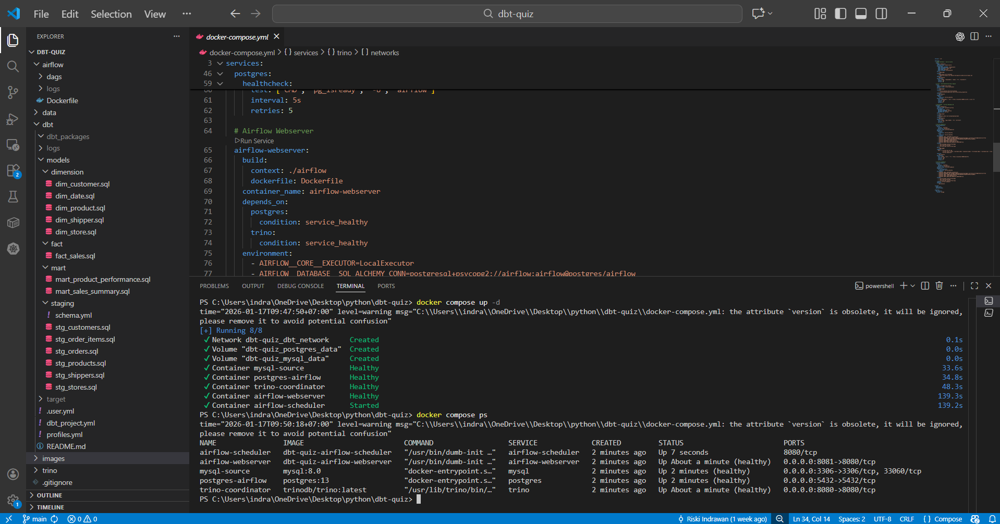
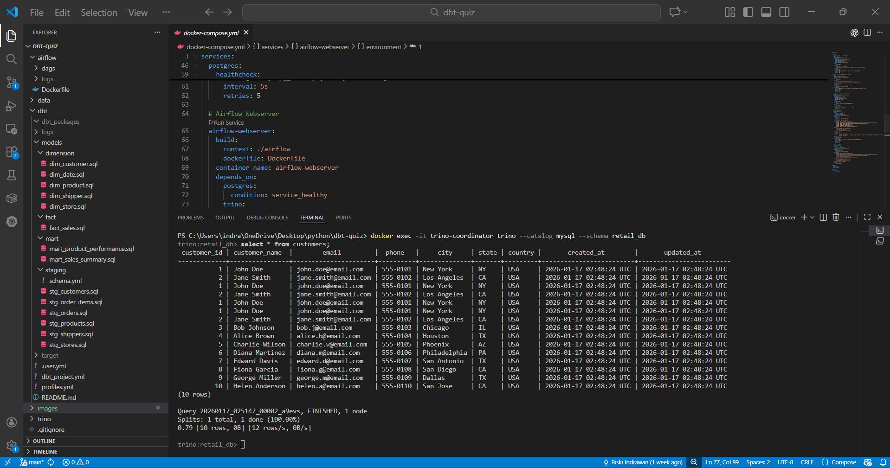
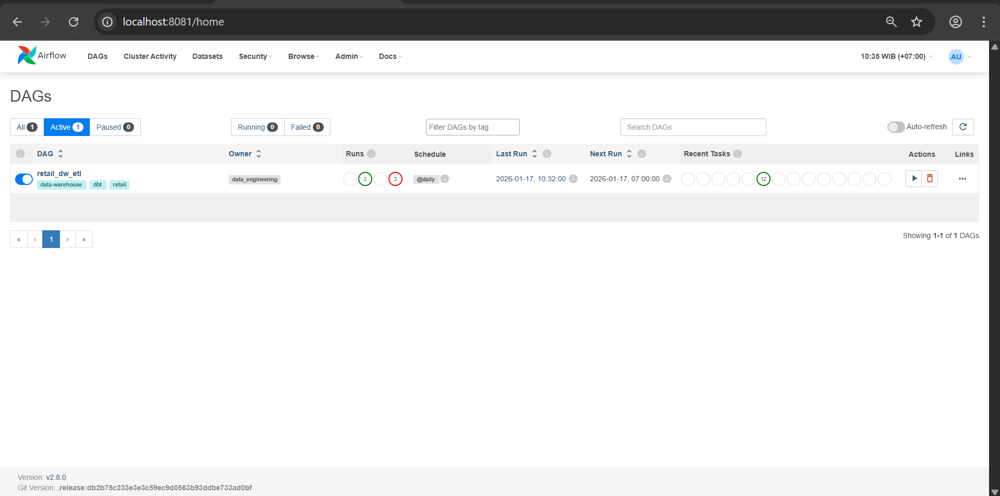
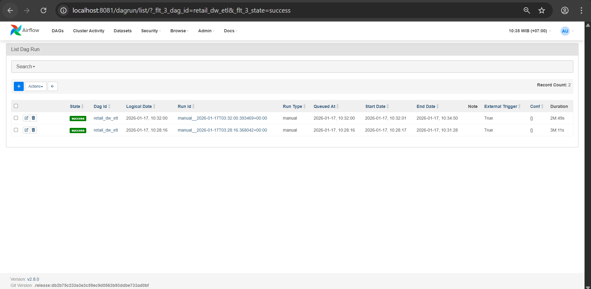
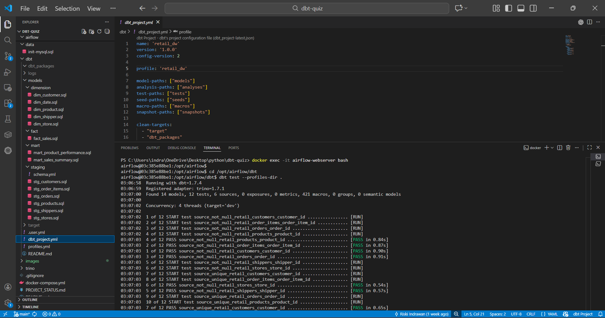
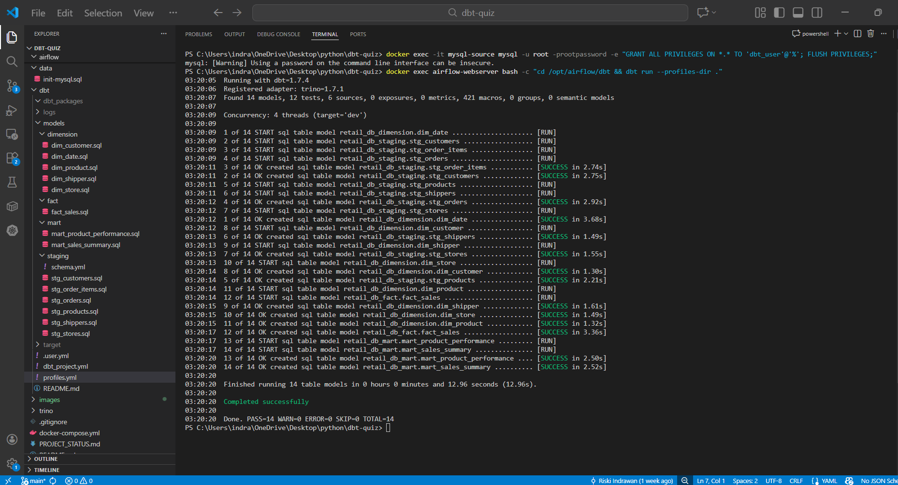

# Retail Data Warehouse - dbt + Trino + Airflow Project

This project implements a complete Data Warehouse solution for a retail business using modern data stack technologies, all running in Docker containers.

## Project Overview

**Business Case**: Retail Business Analytics  
**Source System**: MySQL (OLTP database)  
**Query Engine**: Trino (Distributed SQL)  
**Transformation**: dbt Core  
**Orchestration**: Apache Airflow  
**Infrastructure**: Docker & Docker Compose

## Architecture

```
┌─────────────┐      ┌─────────────┐      ┌─────────────┐      ┌─────────────┐
│   MySQL     │─────▶│   Trino     │─────▶│  dbt Core   │─────▶│   Airflow   │
│  (Source)   │      │  (Engine)   │      │(Transform)  │      │(Orchestrate)│
└─────────────┘      └─────────────┘      └─────────────┘      └─────────────┘
```

## Project Structure

```
dbt-quiz/
├── docker-compose.yml          # Docker services configuration
├── README.md                   # This file
├── data/
│   └── init-mysql.sql         # Sample retail data
├── trino/
│   ├── config.properties      # Trino configuration
│   └── catalog/
│       └── mysql.properties   # MySQL catalog for Trino
├── airflow/
│   ├── Dockerfile             # Custom Airflow image with dbt
│   └── dags/
│       └── retail_dw_etl.py  # ETL orchestration DAG
└── dbt/
    ├── dbt_project.yml        # dbt project configuration
    ├── profiles.yml           # dbt connection profiles
    ├── README.md              # dbt project documentation
    └── models/
        ├── staging/           # Staging models (views)
        │   ├── stg_customers.sql
        │   ├── stg_products.sql
        │   ├── stg_stores.sql
        │   ├── stg_shippers.sql
        │   ├── stg_orders.sql
        │   ├── stg_order_items.sql
        │   └── schema.yml
        ├── dimension/         # Dimension tables (SCD Type 2)
        │   ├── dim_customer.sql
        │   ├── dim_product.sql
        │   ├── dim_store.sql
        │   ├── dim_shipper.sql
        │   └── dim_date.sql
        ├── fact/             # Fact tables
        │   └── fact_sales.sql
        └── mart/             # Data marts
            ├── mart_sales_summary.sql
            └── mart_product_performance.sql
```

## 🚀 Quick Start Guide

### Prerequisites

- Docker Desktop installed and running
- At least 8GB RAM available for Docker
- 10GB free disk space

### Step 1: Clone/Setup Project

The project structure is already created. Navigate to the project directory:

```powershell
cd c:\Users\indra\OneDrive\Desktop\python\dbt-quiz
```

### Step 2: Start All Services

Start all Docker containers (MySQL, Trino, PostgreSQL, Airflow):

```powershell
docker-compose up -d
```

This will start:
- **MySQL** on port 3306 (with sample retail data)
- **Trino** on port 8080
- **Airflow Webserver** on port 8081
- **Airflow Scheduler**
- **PostgreSQL** (Airflow metadata) on port 5432



### Step 3: Wait for Services to Initialize

Check service health:

```powershell
docker-compose ps
```

Wait until all services show "healthy" or "running". This may take 2-3 minutes.

### Step 4: Verify MySQL Data

Check that sample data is loaded:

```powershell
docker exec -it mysql-source mysql -u dbt_user -pdbt_password retail_db -e "SHOW TABLES;"
```

You should see: customers, orders, order_items, products, stores, shippers

### Step 5: Access Trino UI

Open browser: http://localhost:8080

You should see the Trino UI showing the coordinator is running.

### Step 6: Test Trino Connection to MySQL

```powershell
docker exec -it trino-coordinator trino --catalog mysql --schema retail_db
```

Run a test query:
```sql
SHOW TABLES;
SELECT COUNT(*) FROM customers;
```

Type `quit` to exit.



### Step 7: Access Airflow

Open browser: http://localhost:8081

**Login credentials:**
- Username: `admin`
- Password: `admin`

### Step 8: Enable and Run the DAG

1. In Airflow UI, find the DAG named `retail_dw_etl`
2. Toggle it to "ON" (unpause)
3. Click the "Play" button to trigger a manual run
4. Monitor the progress in the Graph or Grid view



Once the DAG completes successfully:



### Step 9: Verify dbt Models

After the DAG completes successfully, verify the created tables in Trino:

```powershell
docker exec -it trino-coordinator trino --catalog mysql --schema retail_db
```

Check created schemas and tables:
```sql
SHOW SCHEMAS FROM mysql;
SHOW TABLES FROM mysql.staging;
SHOW TABLES FROM mysql.dimension;
SHOW TABLES FROM mysql.fact;
SHOW TABLES FROM mysql.mart;

-- Query some data
SELECT * FROM mysql.dimension.dim_customer LIMIT 5;
SELECT * FROM mysql.fact.fact_sales LIMIT 5;
SELECT * FROM mysql.mart.mart_sales_summary LIMIT 5;
```

## Data Model

### Staging Layer
- **stg_customers**: Cleansed customer data
- **stg_products**: Product data with profit margin
- **stg_stores**: Store location data
- **stg_shippers**: Shipping company data
- **stg_orders**: Order header with shipping metrics
- **stg_order_items**: Order line items

### Dimension Layer (with SCD Type 2)
- **dim_customer**: Customer dimension with history tracking
- **dim_product**: Product dimension with price history
- **dim_store**: Store dimension (Type 1)
- **dim_shipper**: Shipper dimension (Type 1)
- **dim_date**: Date dimension for time analysis

### Fact Layer
- **fact_sales**: Transactional sales data with all metrics

### Mart Layer
- **mart_sales_summary**: Aggregated sales for reporting
- **mart_product_performance**: Product performance metrics

## 🔧 Useful Commands

### Docker Management

```powershell
# View logs
docker-compose logs -f [service_name]

# Stop all services
docker-compose down

# Stop and remove volumes (clean slate)
docker-compose down -v

# Restart a specific service
docker-compose restart [service_name]

# View running containers
docker-compose ps
```

### dbt Commands (inside Airflow container)

```powershell
# Enter Airflow container
docker exec -it airflow-webserver bash

# Inside container:
cd /opt/airflow/dbt

# Run specific models
dbt run --profiles-dir . --models staging
dbt run --profiles-dir . --models dimension
dbt run --profiles-dir . --models fact
dbt run --profiles-dir . --models mart

# Run tests
dbt test --profiles-dir .

# Generate documentation
dbt docs generate --profiles-dir .

# Check dbt version
dbt --version
```





### MySQL Commands

```powershell
# Access MySQL CLI
docker exec -it mysql-source mysql -u dbt_user -pdbt_password retail_db

# Backup database
docker exec mysql-source mysqldump -u root -prootpassword retail_db > backup.sql

# View data
docker exec -it mysql-source mysql -u dbt_user -pdbt_password retail_db -e "SELECT * FROM customers;"
```

## Airflow DAG Details

The `retail_dw_etl` DAG orchestrates the complete ETL pipeline:

1. **dbt_debug**: Verify connections
2. **dbt_deps**: Install dependencies
3. **dbt_seed**: Load seed data
4. **dbt_run_staging**: Create staging models
5. **dbt_test_staging**: Test staging models
6. **dbt_run_dimensions**: Create dimension tables
7. **dbt_run_facts**: Create fact tables
8. **dbt_run_marts**: Create data marts
9. **dbt_test_all**: Run all tests
10. **dbt_docs_generate**: Generate documentation

**Schedule**: Daily at midnight (configurable in DAG file)

## Troubleshooting

### Issue: Services won't start

```powershell
# Check logs
docker-compose logs

# Remove old containers and volumes
docker-compose down -v
docker-compose up -d
```

### Issue: MySQL connection error

```powershell
# Check MySQL is running
docker exec mysql-source mysqladmin ping -h localhost

# Verify credentials
docker exec -it mysql-source mysql -u dbt_user -pdbt_password retail_db
```

### Issue: Trino can't connect to MySQL

```powershell
# Check catalog configuration
docker exec trino-coordinator cat /etc/trino/catalog/mysql.properties

# Restart Trino
docker-compose restart trino
```

### Issue: Airflow DAG fails

1. Check Airflow logs: http://localhost:8081 → Browse → Logs
2. Check dbt logs in the task instance
3. Verify dbt can connect:
```powershell
docker exec -it airflow-webserver bash
cd /opt/airflow/dbt
dbt debug --profiles-dir .
```

### Issue: dbt models fail with UUID error

Trino's UUID() function may not work as expected. If you see UUID errors, modify the dimension models to use a different surrogate key generation method (e.g., hash of natural keys).

## Business Use Cases

This data warehouse supports:

1. **Sales Analytics**: Track revenue, margins, and trends
2. **Product Performance**: Identify top/bottom products
3. **Customer Segmentation**: Analyze customer behavior
4. **Inventory Optimization**: Monitor stock movement
5. **Shipping Analysis**: Evaluate shipping performance
6. **Store Performance**: Compare store metrics

## Sample Queries

```sql
-- Top 5 products by revenue
SELECT 
    product_name,
    total_net_revenue,
    total_profit,
    profit_margin_percent
FROM mysql.mart.mart_product_performance
ORDER BY total_net_revenue DESC
LIMIT 5;

-- Monthly sales trend
SELECT 
    year,
    month,
    month_name,
    SUM(total_net_amount) as monthly_revenue,
    SUM(total_profit_amount) as monthly_profit
FROM mysql.mart.mart_sales_summary
GROUP BY year, month, month_name
ORDER BY year, month;

-- Customer purchase history (with SCD)
SELECT 
    customer_name,
    city,
    state,
    valid_from,
    valid_to,
    is_current
FROM mysql.dimension.dim_customer
WHERE customer_id = 1
ORDER BY valid_from;
```

## Security Notes

** WARNING**: This setup uses default credentials and is for DEVELOPMENT ONLY.

For production:
- Change all passwords in docker-compose.yml
- Use secrets management (e.g., Docker secrets, HashiCorp Vault)
- Enable SSL/TLS for all connections
- Implement proper authentication and authorization
- Use environment variables for sensitive data

## Additional Resources

- [dbt Documentation](https://docs.getdbt.com/)
- [Trino Documentation](https://trino.io/docs/current/)
- [Apache Airflow Documentation](https://airflow.apache.org/docs/)
- [Docker Compose Documentation](https://docs.docker.com/compose/)

## Contributing

This project is based on the workshop by Projek DOS:
- GitHub: https://github.com/projekdos/elt_workshop_dbt_trino_batch1

## License

This project is for educational purposes.

---

**Happy Data Engineering! **
